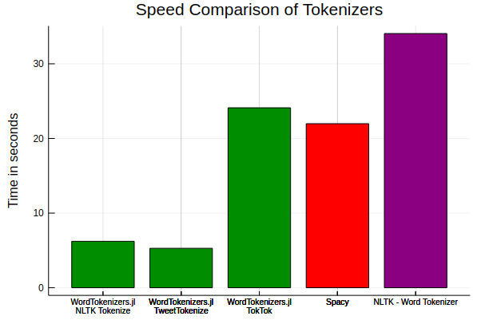

# Summary

WordTokenizers.jl is a tool to help users of the Julia programming language [@Julia], work with natural language.
In natural language processing (NLP) tokenization refers to breaking a text up into parts -- the tokens.
Generally, tokenization refers to breaking a sentence up into words and other tokens such as punctuation.
Such _word tokenization_ also often includes some normalizing, such as correcting unusual spellings or removing all punctuations.
Complementary to word tokenization is _sentence segmentation_ (sometimes called _sentence tokenization_),
where a document is broken up into sentences, which can then be tokenized into words.
Tokenization and sentence segmentation are some of the most fundamental operations to be performed before applying most NLP or information retrieval algorithms.

WordTokenizers.jl provides a flexible API for defining fast tokenizers and sentence segmentors.
Using this API several standard tokenizers and sentence segmenters have been implemented, allowing researchers and practitioners to focus on the higher details of their NLP tasks.

WordTokenizers.jl does not implement significant novel tokenizers or sentence segmenters.
Rather, it contains ports/implementations the well-established and commonly used algorithms.
At present, it contains rules-based methods primarily designed for English.
Several of the implementations are sourced from the Python NLTK project [@NLTK1], [@NLTK2];
although these were in turn sourced from older pre-existing methods.

WordTokenizers.jl uses a `TokenBuffer` API and its various lexers for fast word tokenization.
`TokenBuffer` turns the string into a readable stream.
A desired set of TokenBuffer lexers are used to read characters from the stream and flush out into an array of tokens.
The package provides the following tokenizers made using this API.

- A Tweet Tokenizer [@tweettok] for casual text.
- A general purpose NLTK Tokenizer [@NLTK1], [@NLTK2].
- An improved version of the multilingual Tok-tok tokenizer [@toktok], [@toktokpub].

With various lexers written for the `TokenBuffer` API, users can also create their high-speed custom tokenizers with ease.
The package also provides a simple reversible tokenizer [@reversibletok1], [@reversibletok2],
that works by leaving certain merge symbols, as a means to reconstruct tokens into the original string.

WordTokenizers.jl exposes a configurable default interface,
which allows the tokenizer and sentence segmenters to be configured globally (where this is used).
This allowed for easy benchmarking and comparisons of different methods.

WordTokenizers.jl is currently being used by packages like [TextAnalysis.jl](https://github.com/JuliaText/TextAnalysis.jl), [Transformers.jl](https://github.com/chengchingwen/Transformers.jl) and [CorpusLoaders.jl](https://github.com/JuliaText/CorpusLoaders.jl) for tokenizing text.

## Other similar softwares

There are various NLP libraries and toolkits written in other programming languages, available to Julia users for tokenization.
[NLTK](https://github.com/nltk/nltk) and [Spacy](https://github.com/explosion/spaCy) packages provide with a variety of tokenizers, accessed to Julia users via `PyCall`.
Shown above is a performance benchmark of using some of the WordTokenizers.jl tokenizers vs PyCalling the default tokenizers from NLTK and SpaCy.
This was evaluated on the ~127,000 sentences of the IMDB Movie Review Dataset.
It can be seen that the performance of WordTokenizers.jl is very strong.

There are many more packages like [Stanford CoreNLP](https://github.com/stanfordnlp/CoreNLP), [AllenNLP](https://github.com/allenai/allennlp/) providing a couple of basic tokenizers.
However, WordTokenizers.jl is [faster](https://github.com/Ayushk4/Tweet_tok_analyse/tree/master/speed) and simpler to use, providing with a wider variety of tokenizers and a means to build custom tokenizers.

# References
